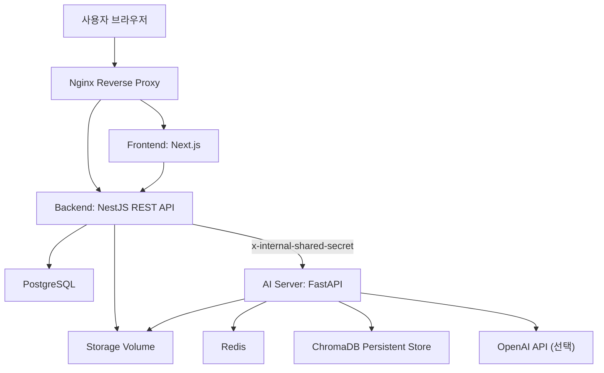

# World Job Search (온세상이취업)

취업 준비생을 위한 **LLM Agent 기반 취업 준비 통합 서비스**입니다. 채용 공고 분석, 자기소개서 피드백, AI 모의면접을 하나의 흐름으로 묶고, 게시판·자료실·마이페이지를 함께 제공합니다.

LLM 응답을 그대로 사용자에게 노출하지 않고, RAG 근거 검색과 단계별 Agent, 서버 검증(Guardrail)을 거쳐 점수 일관성과 근거를 확보하도록 설계했습니다.

---

## 1. 서비스 개요

| 항목 | 내용 |
| --- | --- |
| 서비스명 | 온세상이취업 (World Job Search) |
| 성격 | 로그인 기반 취업 준비 플랫폼 |
| 핵심 흐름 | 공고 분석 → 자기소개서 피드백 → AI 면접 → 마이페이지 리포트 조회 |
| 구성 | Next.js 프론트엔드 · NestJS 백엔드 · FastAPI AI 서버 |
| 데이터 | PostgreSQL(영구) · Redis(면접 세션/임시) · ChromaDB(문서 벡터 검색) |
| 배포 | AWS EC2 단일 서버, Docker Compose + Nginx reverse proxy |

프론트엔드는 항상 NestJS 공개 API만 호출합니다. FastAPI AI 서버는 외부에 직접 노출하지 않으며, NestJS가 `x-internal-shared-secret` 헤더로만 내부 호출합니다.

---

## 2. 주요 기능

| 대분류 | 기능 | 설명 |
| --- | --- | --- |
| 사용자 관리 | 회원가입 / 로그인 | 이메일·아이디·표시 이름·비밀번호 기반 계정 생성, 비밀번호 bcrypt 해시 저장 |
| 사용자 관리 | 이메일 인증 | Gmail SMTP로 인증 메일 발송, 토큰은 해시로 저장, 미인증 계정 로그인 제한 |
| 사용자 관리 | JWT 보호 API | Authorization Bearer 토큰 기반 인증(`JwtAuthGuard`) |
| 커뮤니티 | 게시판 | 글 작성·조회·수정·삭제·좋아요, 댓글 |
| 자료 관리 | 자료실 | 파일 업로드·설명 등록·다운로드 |
| 공고 분석 | JD 분석 | 회사명·직무명·키워드·기술 스택·요구 역량 추출 및 저장 |
| AI 자소서 | 피드백 생성 | JD와 사용자 문서(자소서/이력서/포트폴리오) 기반 점수·강점·약점·수정 방향·수정 초안 생성 |
| AI 자소서 | 리포트 관리 | 리포트 목록·상세·삭제 |
| AI 면접 | 세션 진행 | 질문 계획 생성, 영상/텍스트 답변, STT 전사, 답변 평가, 다음 질문 결정 |
| AI 면접 | 최종 리포트 | 5턴 이상 답변 기준으로 최종 점수·강점·보완점·연습 방향 생성 |
| 마이페이지 | 활동 조회 | 내가 쓴 글, 좋아요한 글, 저장된 자소서 리포트 조회 |

---

## 3. 아키텍처



| 구성요소 | 역할 |
| --- | --- |
| Frontend (Next.js) | 로그인·홈·게시판·자료실·AI 자소서·AI 면접·마이페이지 화면 |
| Backend (NestJS) | 공개 REST API, 인증/인가, DB 저장, 파일 저장, AI 서버 호출, 권한 검증 |
| AI Server (FastAPI) | 공고 분석, 자소서 Agent pipeline, 면접 Agent pipeline |
| PostgreSQL | 사용자·게시글·자료실·공고 분석·자소서 리포트·면접 세션/턴 영구 저장 |
| Redis | 면접 세션 상태, hidden score, transcript, cleanup 임시 데이터 |
| ChromaDB | 자소서/면접 문서 chunk 임베딩 및 유사도 검색 (PersistentClient) |
| Nginx | `/`는 frontend, `/backend/`는 NestJS로 프록시 |

---

## 4. 기술 스택

| 영역 | 기술 |
| --- | --- |
| Frontend | Next.js 15, React 19, TypeScript, Tailwind CSS, next-auth, axios, react-hook-form, zod, lucide-react |
| Backend | NestJS 11, TypeScript, TypeORM, Passport-JWT, bcrypt, Nodemailer, Swagger, Multer |
| AI Server | FastAPI, Pydantic, LangGraph, ChromaDB, OpenAI SDK, MediaPipe, OpenCV, Redis |
| Database | PostgreSQL 16, Redis 7 |
| Vector DB | ChromaDB (로컬 persistent volume) |
| Infra | Docker Compose, Nginx, AWS EC2 (Ubuntu) |

> AI 서버 의존성 전체는 `ai/requirements.txt`, 백엔드/프론트 의존성은 각 `package.json`을 기준으로 합니다.

---

## 5. 디렉토리 구조

```text
World_Job_Search/
├── frontend/                # Next.js 사용자 화면 (App Router)
│   └── src/app/             # login, board, dataroom, ai_cover_letter, ai_interview, mypage ...
├── backend/                 # NestJS 공개 API
│   └── src/                 # auth, users, post, dataroom, files, jobs, cover-letter, interview, ai-client, storage ...
├── ai/                      # FastAPI 내부 AI 서버
│   └── app/
│       ├── api/routes/      # health, jobs, cover_letter, interview
│       └── services/        # cover_letter, interview, jobs, stt, tts, vision
├── docs/                    # AI 계약, 저장 정책, 면접 규칙, 단계별 점검, 배포 계획 문서
├── nginx/                   # world-jobsearch.conf (reverse proxy)
├── docker-compose.yml       # 로컬 개발용
├── docker-compose.prod.yml  # 운영 배포용
└── 자료/                    # 원본 요구사항, API 명세, 아키텍처, ERD 자료
```

---

## 6. 로컬 실행

### 6.1 무과금 실행 원칙

아래 값을 비워 두면 AI 서버는 OpenAI 호출 대신 **로컬 heuristic / RAG fallback**으로 동작합니다. 값이 없어도 전체 기능 흐름이 동작하도록 설계되어 있습니다.

- `OPENAI_API_KEY`
- `ANTHROPIC_API_KEY`
- `GOOGLE_API_KEY`

무과금 실행용 예시 환경변수는 다음 파일을 참고합니다.

- `ai/.env.no-cost.example`
- `backend/.env.no-cost.example`
- `frontend/.env.no-cost.example`

### 6.2 Docker Compose 실행 (권장)

```bash
docker compose up --build
```

### 6.3 서비스별 직접 실행

```bash
# AI 서버
cd ai
pip install -r requirements.txt
uvicorn app.main:app --reload

# 백엔드
cd backend
pnpm install
pnpm run start:dev

# 프론트엔드
cd frontend
pnpm install
pnpm dev
```

### 6.4 기본 포트

| 서비스 | 주소 |
| --- | --- |
| Frontend | http://localhost:3000 |
| Backend API | http://localhost:3001 |
| Backend Swagger | http://localhost:3001/docs |
| AI internal API | http://localhost:8000 (`/health`) |
| PostgreSQL | localhost:5432 |
| Redis | localhost:6379 |

---

## 7. 주요 API

### 7.1 백엔드 공개 API (NestJS, 기본 `:3001`)

| Method | Endpoint | 설명 |
| --- | --- | --- |
| POST | `/auth/signup` | 회원가입 |
| POST | `/auth/login` | 로그인 |
| GET | `/auth/verify-email` | 이메일 인증 |
| POST | `/auth/resend-verification` | 인증 메일 재발송 |
| GET | `/users/me` | 내 정보 조회 |
| POST · GET · GET · PUT · DELETE | `/posts`, `/posts/:id` | 게시글 CRUD |
| POST | `/posts/:id/like` | 게시글 좋아요 |
| POST · GET · DELETE | `/dataroom`, `/dataroom/:id` | 자료실 등록·목록·삭제 |
| POST · GET | `/files`, `/files/:id/download` | 파일 업로드·다운로드 |
| POST | `/jobs/analyze` | 공고 분석 |
| GET | `/jobs/analysis-requests/latest`, `/jobs/analysis-requests/:id` | 공고 분석 조회 |
| POST | `/ai/cover-letter/feedback` | 자소서 피드백 생성 |
| GET · GET · DELETE | `/ai/cover-letter/reports`, `/ai/cover-letter/reports/:reportId` | 자소서 리포트 관리 |
| POST | `/ai/interview/sessions/start` | 면접 시작 |
| POST | `/ai/interview/sessions/uploads` | 면접 답변 파일 업로드 |
| POST | `/ai/interview/sessions/:sessionId/answers` | 면접 답변 제출 |
| POST | `/ai/interview/sessions/:sessionId/finish` | 면접 종료 |
| GET | `/ai/interview/sessions`, `/ai/interview/sessions/:sessionId`, `.../turns` | 면접 세션·턴 조회 |

전체 명세는 서버 실행 후 Swagger(`/docs`)에서 확인할 수 있습니다.

### 7.2 AI 내부 API (FastAPI, `:8000`, `x-internal-shared-secret` 보호)

| Method | Endpoint | 설명 |
| --- | --- | --- |
| GET | `/health` | 헬스 체크 |
| POST | `/internal/jobs/analyze` | 공고 분석 |
| POST | `/internal/cover-letter/feedback` | 자기소개서 피드백 |
| POST | `/internal/interview/start` | 면접 시작 |
| POST | `/internal/interview/answer` | 면접 답변 처리 |
| POST | `/internal/interview/finish` | 면접 종료 |

---

## 8. AI Agent 파이프라인

LLM을 단순 호출하지 않고, 단계별 Agent와 서버 검증(Guardrail)을 조합합니다. Orchestration은 LangGraph 기반이며, LLM 키가 없을 때는 fallback runner로 순차 실행됩니다.

### 8.1 자기소개서 피드백 (`ai/app/services/cover_letter/`)

```text
JD Analyzer → RAG Retriever → Evidence Extractor → Evaluator
→ Evaluation Validator → Draft Generator → Draft Reviewer
```

| 단계 | 파일 | 역할 |
| --- | --- | --- |
| JD Analyzer | `jd_analyzer_agent.py` | 공고 키워드·직무 초점 추출 |
| RAG Retriever | `rag_retriever_agent.py` | JD·자소서·이력서·포트폴리오 chunk 검색 |
| Evidence Extractor | `evidence_extractor_agent.py` | 근거를 평가 context로 정리 |
| Evaluator | `cover_letter_evaluator_agent.py` | 총점·JD 반영도·직무 적합도·문항별 점수 생성 |
| Evaluation Validator | `evaluation_validator_agent.py` | evidence·rubric·점수 일관성 검증 |
| Draft Generator | `draft_generator_agent.py` | 입력 근거 범위 내 수정 초안 생성 |
| Draft Reviewer | `draft_reviewer_agent.py` | 근거 없는 내용 생성 여부 검토 |
| Orchestrator | `cover_letter_graph.py` | LangGraph / fallback 순차 실행 |
| RAG Store | `vector_rag_store.py` | ChromaDB 문서 chunk 저장·검색 |

### 8.2 AI 면접 (`ai/app/services/interview/`)

```text
Question Planner → (답변 제출) → STT Service → Answer Evaluator
→ Evaluation Validator → Vision Service → Next Question Resolver → Finish Service
```

| 단계 | 파일 | 역할 |
| --- | --- | --- |
| Question Planner | `question_planner.py` | 면접 질문 계획 생성 |
| STT Service | `stt_service.py` | 영상 답변 전사, 2회 실패 시 텍스트 답변 전환 |
| Answer Evaluator | `answer_evaluator.py` | 답변 내용 점수화 |
| Evaluation Validator | `evaluation_validator.py` | 평가가 실제 답변과 일치하는지 검증 |
| Vision Service | `vision_service.py` | 얼굴 유지율·촬영 상태 등 비언어 평가 (MediaPipe/OpenCV) |
| Next Question Resolver | `next_question_resolver.py` | 다음 질문·후속 질문·종료 결정 |
| Finish Service | `finish_service.py` | 최종 리포트 생성 |
| Cleanup Service | `cleanup_service.py` | 임시 답변 파일·세션 데이터 정리 |

### 8.3 Guardrail 요약

- **인증**: 인증된 사용자만 AI 기능·게시판 작성·자료 업로드 접근.
- **입력**: DTO 검증, 파일 확장자·크기 제한(면접 영상 `.mp4/.mov/.webm/.m4a/.mp3/.wav`, 최대 120MB).
- **출력**: `rubricScores` 서버 정규화, `totalScore`는 rubric 합계 기반 재계산, evidenceText가 실제 입력 문서/JD에 존재하는지 검증. 상단 점수와 항목 점수 차이가 15점 이상이면 validator 실패 처리.
- **실패 복구**: STT 실패 시 재업로드/텍스트 전환, Redis TTL 만료 시 PostgreSQL 저장 턴(5개 이상) 기준으로 최종 리포트 복구.

---

## 9. 데이터베이스

| 테이블 | 설명 |
| --- | --- |
| `users` | 사용자 계정, 인증 정보, 역할, 이메일 인증 상태 |
| `job_analysis_requests` | 공고 분석 요청과 결과 |
| `cover_letter_reports` | 자기소개서 피드백 리포트 |
| `interview_sessions` | AI 면접 세션 |
| `interview_turns` | 면접 답변 턴과 점수 |
| `post` / `comment` / `post_like` | 게시판 글·댓글·좋아요 |
| `dataroom` / `file_entity` | 자료실 항목·업로드 파일 metadata |

---

## 10. 테스트 및 검증

```bash
cd ai && pytest
cd backend && pnpm test          # 또는 npm test -- --runInBand
cd frontend && pnpm build
```

AI 테스트(`ai/tests/test_rag_and_prompt_contracts.py`)는 RAG prompt contract, 무과금 fallback 경로, validator, 면접 답변 평가 Guardrail을 포함합니다. 통합 시나리오는 `docs/local-integration-checklist.md`를 기준으로 확인합니다.

임시 저장소 orphan 파일 점검:

```bash
cd backend
npm run storage:cleanup-temp -- --dry-run
```

### 로컬 검증 결과 (2026-05-16 기준)

- `frontend`: `pnpm run build` 통과, Docker 런타임에서 Next.js `next start` 확인
- `docker compose up --build -d`: frontend/backend/ai/postgres/redis 기동 확인
- 로그인 후 `/users/me`, 공고 분석, 자소서 피드백 API 흐름 확인
- Vision: MediaPipe backend로 얼굴 미검출 샘플 영상 `INVALID` 판정 확인
- cleanup: temp answer video orphan 14개 삭제 후 dry-run 결과 0개 확인

---

## 11. 배포

운영 배포는 `docker-compose.prod.yml` 기준으로 `postgres` · `redis` · `ai` · `backend` · `frontend` 서비스를 실행합니다.

```text
사용자 브라우저
→ EC2 Public IP (또는 HTTPS tunnel)
→ Nginx (world-jobsearch.conf)
→ frontend  (127.0.0.1:3000)
→ backend   (127.0.0.1:3001)
→ ai        (Docker network ai:8000)
→ PostgreSQL / Redis / ChromaDB volume
```

`backend`와 `frontend`만 host localhost 포트로 바인딩하고, PostgreSQL·Redis·AI는 Docker network 내부에서만 통신합니다. 배포 환경변수 예시는 `.env.production.example`, 세부 절차는 `docs/aws-ec2-minimal-deploy.md`, `docs/aws-migration-plan.md`를 참고합니다.

---

## 12. 핵심 문서

| 문서 | 내용 |
| --- | --- |
| `docs/ai-contract.md` | AI 서버 요청/응답 계약 |
| `docs/interview-rules.md` | 면접 진행·평가 규칙 |
| `docs/storage-policy.md` | 파일/임시 저장 정책 |
| `docs/redis-key-design.md` | Redis 키 설계 |
| `docs/storage-architecture.md` | 저장소 아키텍처 |
| `docs/ai-agent-architecture.md` | AI Agent 구조 |
| `docs/local-integration-checklist.md` | 로컬 통합 점검 시나리오 |
| `docs/aws-ec2-minimal-deploy.md`, `docs/aws-migration-plan.md` | 배포 계획 |
| `docs/deep-implementation-security-audit.md` | 보안 점검 |
| `docs/final-graduation-report-draft.md` | 졸업작품 최종 보고서 정리본 |

---

## 13. 한계 및 개선 방향

- **LLM 환각**: Guardrail을 적용했으나 생성 결과의 사실성을 100% 보장하지는 않는다.
- **응답 지연**: RAG·STT·evaluator·validator 순차 실행으로 답변 제출 시간이 길어질 수 있다 → 면접 답변을 background job으로 분리 검토.
- **HTTPS/도메인**: 임시 tunnel은 운영용으로 부적합 → 정식 도메인 + Let's Encrypt/Cloudflare named tunnel.
- **RAG 운영**: ChromaDB PersistentClient는 단일 서버 중심 → pgvector 또는 Chroma server 전환 고려.
- **보안/모니터링**: 졸업작품 수준 → refresh token, rate limiting, audit log, 호출 시간·실패율·비용 모니터링 확대.

---