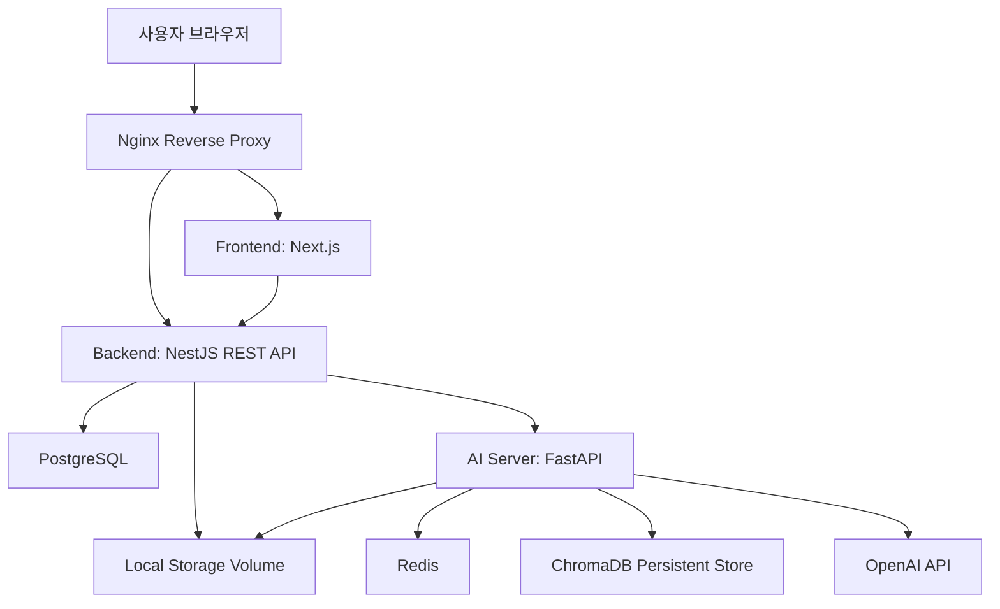
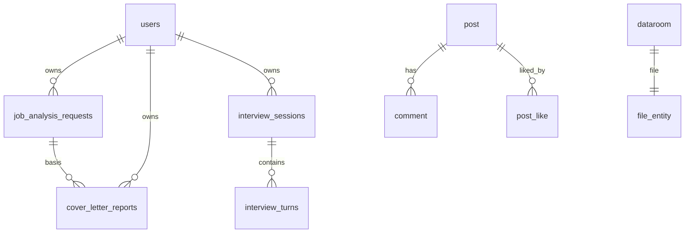

# World Job Search 졸업작품 최종 보고서 정리본

> 기준 코드: `frontend`, `backend`, `ai`, `docker-compose.prod.yml`, `nginx/world-jobsearch.conf` 현재 구현 상태

---

## 0. 표지

| 항목 | 내용 |
| --- | --- |
| 프로젝트명 | World Job Search |
| 서비스명 | 온세상이취업 |
| 부제 | 취업 준비생을 위한 LLM Agent 기반 공고 분석, 자기소개서 피드백, AI 모의면접 서비스 |
| 팀명 | 작성 필요 |
| 팀원 | 이름 / 학번 / 역할 작성 필요 |
| 지도교수 | 작성 필요 |
| 소속 | 작성 필요 |
| 제출일 | 2026년 5월 28일 기준 작성 |

### 표지 설명 문장 예시

본 프로젝트는 취업 준비생이 채용 공고를 분석하고, 자기소개서를 점검하며, 면접 답변을 연습할 수 있도록 지원하는 LLM Agent 기반 취업 준비 통합 서비스이다.

---

## 1. 초록 / 요약

본 프로젝트는 취업 준비 과정에서 발생하는 정보 탐색, 자기소개서 작성, 면접 연습의 부담을 줄이기 위해 개발한 LLM Agent 기반 취업 준비 통합 서비스이다. 사용자는 채용 공고를 입력하여 공고 핵심 키워드와 요구 역량을 분석할 수 있으며, 자기소개서와 이력서, 포트폴리오를 기반으로 AI 피드백과 수정 방향을 받을 수 있다. 또한 AI 면접 기능을 통해 질문을 받고 영상 또는 텍스트로 답변한 뒤, STT, 답변 평가, 비언어 평가, 최종 리포트를 확인할 수 있다.

시스템은 Next.js 기반 프론트엔드, NestJS 기반 백엔드, FastAPI 기반 AI 서버로 분리되어 있으며, PostgreSQL에는 사용자와 서비스 데이터를 저장하고 Redis에는 AI 면접 세션 및 임시 결과를 저장한다. 자기소개서와 면접 분석에는 OpenAI API, RAG, ChromaDB, LangGraph 기반 Agent 흐름, 서버 검증 로직이 사용된다. 특히 LLM의 응답을 그대로 사용자에게 제공하지 않고 evaluator, validator, draft generator, reviewer 등 단계별 Agent와 Guardrail을 적용해 점수 일관성, 근거 검증, 출력 형식 안정성을 확보하도록 설계하였다.

주요 구현 범위는 회원가입/로그인, 이메일 인증, 게시판, 자료실, 공고 분석, AI 자기소개서 피드백, AI 면접, 마이페이지 리포트 조회이다. 배포는 AWS EC2 단일 서버에서 Docker Compose로 프론트엔드, 백엔드, AI 서버, PostgreSQL, Redis를 실행하고 Nginx로 외부 요청을 프록시하는 구조로 구성하였다.

---

## 2. 프로젝트 개요

### 2.1 프로젝트 배경

최근 생성형 AI와 LLM 기술이 발전하면서 자연어 기반의 개인화 서비스가 빠르게 확산되고 있다. 취업 준비 영역에서도 채용 공고 분석, 자기소개서 첨삭, 면접 연습과 같은 작업은 반복적이면서도 개인별 맥락이 중요하다. 그러나 기존 취업 준비 방식은 사용자가 여러 웹사이트에서 정보를 직접 수집하고, 공고 요구사항과 자신의 경험을 스스로 연결해야 하며, 면접 답변에 대한 객관적인 피드백을 받기 어렵다는 한계가 있다.

기존 취업 플랫폼은 채용 공고 탐색과 지원 정보 제공에 집중되어 있으며, 자기소개서와 면접을 하나의 흐름으로 연결하는 기능은 제한적이다. 또한 단순 챗봇 형태의 AI 서비스는 사용자의 입력에 자연어로 답변할 수는 있지만, 공고 분석 결과를 저장하고 이후 자기소개서와 면접 평가에 재사용하는 통합적 흐름은 부족하다.

본 프로젝트는 이러한 문제를 해결하기 위해 공고 분석, 자기소개서 피드백, AI 면접, 커뮤니티, 자료실을 하나의 서비스로 묶고, LLM Agent 구조를 통해 분석, 검색, 평가, 검증, 리포트 생성을 단계적으로 수행하도록 설계하였다.

### 2.2 문제 정의

대상 사용자는 취업 준비생, 대학생, 신입 개발자 지원자, 자기소개서와 면접 준비가 필요한 사용자이다.

현재 사용자는 다음과 같은 방식으로 취업 준비를 수행한다.

1. 채용 공고를 직접 읽고 핵심 역량을 정리한다.
2. 자기소개서가 공고와 잘 연결되는지 스스로 판단한다.
3. 면접 예상 질문을 직접 만들거나 외부 자료를 참고한다.
4. 답변을 녹음하거나 주변 사람에게 피드백을 요청한다.
5. 여러 사이트와 파일에 흩어진 결과를 따로 관리한다.

핵심 문제는 다음과 같다.

| 구분 | 문제 |
| --- | --- |
| 정보 탐색 | 채용 공고의 요구 역량, 기술 스택, 직무 핵심을 직접 파악해야 한다. |
| 자기소개서 평가 | 자소서가 JD와 연결되는지, 경험 근거가 충분한지 객관적으로 판단하기 어렵다. |
| 면접 연습 | 실제 면접처럼 질문, 답변, 후속 질문, 피드백을 반복하기 어렵다. |
| 결과 관리 | 공고 분석, 자소서 리포트, 면접 결과가 분산되어 누적 관리가 어렵다. |
| AI 신뢰성 | LLM이 근거 없는 내용을 생성하거나 점수 일관성이 흔들릴 수 있다. |

해결 목표는 LLM Agent를 활용하여 채용 공고와 사용자 문서를 분석하고, RAG 기반 근거 검색과 Guardrail 검증을 통해 신뢰성 있는 자기소개서 및 면접 피드백을 제공하는 것이다.

### 2.3 프로젝트 목표

| 구분 | 목표 |
| --- | --- |
| 기능적 목표 | 회원가입/로그인, 이메일 인증, 공고 분석, 자기소개서 피드백, AI 면접, 마이페이지 리포트 조회를 제공한다. |
| 기술적 목표 | Next.js, NestJS, FastAPI, PostgreSQL, Redis, ChromaDB, Docker 기반의 분리형 시스템을 구현한다. |
| AI 목표 | LLM을 단순 호출하지 않고 Agent pipeline, RAG, validator, fallback을 적용한다. |
| 사용자 경험 목표 | 취업 준비 흐름을 공고 분석 → 자소서 점검 → 면접 연습 → 리포트 확인으로 자연스럽게 연결한다. |
| 안정성 목표 | STT 실패, LLM 응답 불일치, Redis TTL 만료, API timeout 등 실패 상황에 대응한다. |
| 배포 목표 | AWS EC2에서 Docker Compose와 Nginx를 이용해 실제 접근 가능한 서비스로 배포한다. |

### 2.4 기대 효과

- 취업 준비생은 공고 분석부터 자기소개서와 면접까지 하나의 서비스에서 관리할 수 있다.
- AI 피드백은 단순 문장 첨삭이 아니라 JD, 이력서, 포트폴리오와의 연결성을 함께 평가한다.
- 면접 기능은 질문 생성, 답변 제출, STT, 답변 평가, 비언어 평가, 최종 리포트까지 제공한다.
- 커뮤니티와 자료실을 통해 사용자 간 정보 공유와 자료 관리가 가능하다.
- LLM Agent 구조와 Guardrail을 적용해 단순 챗봇보다 안정적인 AI 서비스 구조를 제시한다.

---

## 3. 관련 기술 및 기존 서비스 분석

### 3.1 기존 서비스 분석

| 비교 항목 | 일반 채용 플랫폼 | 일반 AI 챗봇 | 본 프로젝트 |
| --- | --- | --- | --- |
| 채용 공고 확인 | 지원 | 사용자가 직접 입력 필요 | 공고 분석 결과 저장 |
| 자기소개서 피드백 | 일부 지원 | 가능하지만 맥락 저장 약함 | JD, 자소서, 이력서, 포트폴리오 기반 평가 |
| 면접 연습 | 제한적 | 질의응답 가능 | 질문 생성, STT, 평가, 리포트 제공 |
| 개인화 | 이력서 기반 일부 | 대화 맥락 중심 | 사용자별 공고/리포트/면접 세션 저장 |
| RAG | 일반적으로 제한적 | 별도 구현 필요 | ChromaDB 기반 문서 검색 |
| Agent 구조 | 없음 또는 불명확 | 단순 호출 중심 | 단계별 Agent pipeline |
| Guardrail | 불명확 | 모델 의존 | 서버 검증, 점수 보정, evidence 검증 |
| 결과 저장 | 지원 | 제한적 | PostgreSQL 기반 마이페이지 조회 |

본 프로젝트의 차별점은 채용 공고 분석 결과를 자기소개서 피드백과 면접 기능에서 재사용하고, LLM 응답을 그대로 제공하지 않고 RAG와 validator를 거쳐 서비스 데이터로 저장한다는 점이다.

### 3.2 관련 기술 설명

| 기술 | 본 프로젝트에서의 사용 |
| --- | --- |
| LLM | 공고 분석, 자기소개서 평가, 수정 초안 생성, 면접 질문 생성, 답변 평가, 최종 리포트 생성에 사용 |
| Prompt Engineering | JSON 출력 형식, 평가 기준, 금지사항, 근거 기반 응답 조건을 프롬프트에 명시 |
| RAG | 자기소개서/이력서/포트폴리오/JD를 chunk로 나누고 ChromaDB에서 유사도 검색 |
| Vector DB | ChromaDB PersistentClient를 사용해 문서 chunk와 metadata 저장 |
| Agent | JD analyzer, RAG retriever, evidence extractor, evaluator, validator, draft generator, reviewer 등으로 분리 |
| Guardrail | evidence 검증, 점수 일관성 검사, validator 재시도, fallback, timeout, 인증 검사 적용 |
| FastAPI | AI 내부 API 서버 구현 |
| NestJS | 공개 REST API, 인증, DB 연동, 파일 저장, AI 서버 호출 담당 |
| Next.js | 사용자 화면, 로그인, 게시판, 자료실, AI 기능 화면 구현 |
| PostgreSQL | 사용자, 게시글, 자료실, 공고 분석, 자소서 리포트, 면접 세션 저장 |
| Redis | 면접 세션 상태, 임시 transcript, hidden score, cleanup 관리 |
| Docker Compose | frontend/backend/ai/postgres/redis 컨테이너 실행 |
| Nginx | 외부 80 요청을 frontend와 backend로 프록시, `/backend` prefix 분리 |

---

## 4. 요구사항 분석

### 4.1 사용자 요구사항

| 번호 | 요구사항 |
| --- | --- |
| UR-01 | 사용자는 이메일 기반 회원가입과 로그인을 할 수 있어야 한다. |
| UR-02 | 사용자는 이메일 인증 후 보호 API와 AI 기능을 사용할 수 있어야 한다. |
| UR-03 | 사용자는 채용 공고 URL 또는 JD 텍스트를 기반으로 공고 분석을 생성할 수 있어야 한다. |
| UR-04 | 사용자는 자기소개서, 이력서, 포트폴리오 텍스트 또는 파일을 입력해 AI 피드백을 받을 수 있어야 한다. |
| UR-05 | 사용자는 자소서 리포트의 요약, 문항별 피드백, 수정 초안, 세부 기준을 확인할 수 있어야 한다. |
| UR-06 | 사용자는 AI 면접 세션을 시작하고 질문에 영상 또는 텍스트로 답변할 수 있어야 한다. |
| UR-07 | 사용자는 면접 답변별 피드백과 최종 리포트를 확인할 수 있어야 한다. |
| UR-08 | 사용자는 게시판 글 작성, 조회, 수정, 삭제, 좋아요를 사용할 수 있어야 한다. |
| UR-09 | 사용자는 자료실에 파일과 설명을 등록하고 조회할 수 있어야 한다. |
| UR-10 | 사용자는 마이페이지에서 내가 쓴 글, 좋아요한 글, 저장된 자소서 리포트를 조회할 수 있어야 한다. |

### 4.2 기능 요구사항

| 번호 | 기능 요구사항 | 구현 위치 |
| --- | --- | --- |
| FR-01 | 회원가입 / 로그인 / JWT 발급 | `backend/src/auth` |
| FR-02 | Gmail SMTP 기반 이메일 인증 | `backend/src/auth/mail.service.ts` |
| FR-03 | 보호 API 인증 | `JwtAuthGuard`, `JwtStrategy` |
| FR-04 | 공고 분석 생성 및 저장 | `backend/src/jobs`, `ai/app/services/jobs` |
| FR-05 | 자기소개서 피드백 생성 | `backend/src/cover-letter`, `ai/app/services/cover_letter` |
| FR-06 | RAG 기반 근거 검색 | `vector_rag_store.py`, `rag_retriever_agent.py` |
| FR-07 | 평가 validator 및 점수 보정 | `evaluation_validator_agent.py`, `cover_letter_evaluator_agent.py` |
| FR-08 | 수정 초안 생성 및 검토 | `draft_generator_agent.py`, `draft_reviewer_agent.py` |
| FR-09 | AI 면접 시작 / 답변 / 종료 | `backend/src/interview`, `ai/app/services/interview` |
| FR-10 | 영상 답변 업로드 및 STT | `interview.controller.ts`, `stt_service.py` |
| FR-11 | 비언어 평가 | `vision_service.py`, MediaPipe/OpenCV 기반 확장 구조 |
| FR-12 | 최종 리포트 생성 | `finish_service.py`, DB fallback |
| FR-13 | 게시판 CRUD 및 좋아요 | `backend/src/post` |
| FR-14 | 자료실 파일 업로드 및 다운로드 | `backend/src/files`, `backend/src/dataroom` |
| FR-15 | 마이페이지 리포트 및 활동 조회 | `frontend/src/app/mypage/page.tsx` |

### 4.3 비기능 요구사항

| 구분 | 요구사항 | 구현 방식 |
| --- | --- | --- |
| 보안 | 인증된 사용자만 AI 기능 접근 | JWT Bearer token, `JwtAuthGuard` |
| 개인정보 보호 | 비밀번호 hash 저장 | `bcrypt` password hash |
| 이메일 검증 | 미인증 계정 로그인 제한 | `isEmailVerified`, verification token hash |
| 안정성 | AI 서버 timeout 대응 | `AI_INTERNAL_REQUEST_TIMEOUT_MS`, `AI_INTERVIEW_ANSWER_TIMEOUT_MS` |
| 신뢰성 | LLM 점수와 근거 검증 | rubric 검증, evidence verification, validator |
| 유지보수성 | FE/BE/AI 모듈 분리 | Next.js / NestJS / FastAPI 독립 컨테이너 |
| 확장성 | Agent와 Tool 교체 가능 | service 파일 단위 분리, ChromaDB 교체 가능 구조 |
| 배포성 | 동일 환경 실행 | Docker Compose, healthcheck |
| 사용성 | 실패 상황 메시지 제공 | 브라우저 STT 상태, API 에러 메시지 |
| 복구성 | Redis TTL 만료 시 DB fallback | 면접 최종 리포트 DB 턴 기반 복구 |

---

## 5. 서비스 주요 기능

### 5.1 전체 기능 목록

| 대분류 | 기능 | 설명 |
| --- | --- | --- |
| 사용자 관리 | 회원가입 / 로그인 | 이메일, 아이디, 표시 이름, 비밀번호 기반 계정 생성 |
| 사용자 관리 | 이메일 인증 | Gmail SMTP로 인증 메일 발송, 토큰 hash 저장 |
| 사용자 관리 | JWT 보호 API | Authorization Bearer token 기반 인증 |
| 커뮤니티 | 게시판 | 글 작성, 조회, 수정, 삭제, 좋아요 |
| 자료 관리 | 자료실 | 파일 업로드, 자료 설명, 다운로드 |
| 공고 분석 | JD 분석 | 회사명, 직무명, JD, 키워드, 기술 스택 저장 |
| AI 자소서 | 피드백 생성 | JD와 사용자 문서 기반 점수/강점/약점/수정 방향 생성 |
| AI 자소서 | 리포트 관리 | 생성된 리포트 목록/상세/삭제 |
| AI 면접 | 질문 생성 | JD와 사용자 문서를 바탕으로 면접 질문 계획 |
| AI 면접 | 답변 제출 | 영상 또는 텍스트 답변 제출 |
| AI 면접 | STT / 평가 | 영상 답변 전사, 답변 내용 평가 |
| AI 면접 | 최종 리포트 | 턴별 점수와 피드백 기반 최종 리포트 |
| 마이페이지 | 활동 조회 | 내가 쓴 글, 좋아요한 글, 자소서 리포트 확인 |

### 5.2 기능별 상세

#### 기능 1. 회원가입 / 로그인 / 이메일 인증

목적은 사용자별 AI 분석 결과와 게시판 활동을 안전하게 분리하는 것이다. 사용자는 이메일, username, displayName, password를 입력해 가입하며, 비밀번호는 bcrypt hash로 저장된다. 가입 시 이메일 인증 토큰을 생성하고 hash만 DB에 저장한 뒤 Gmail SMTP로 인증 링크를 발송한다. 로그인 시 이메일 인증 여부를 확인하며, 인증되지 않은 경우 로그인 거부와 재발송 흐름을 제공한다.

예외 처리는 중복 이메일, 중복 username, SMTP 미설정, 메일 발송 실패, 토큰 만료, 인증 완료 계정 재요청 등을 포함한다.

#### 기능 2. 공고 분석

사용자는 채용 공고 URL 또는 JD 텍스트를 입력한다. 백엔드는 요청을 저장하고 FastAPI AI 서버로 전달한다. AI 서버는 공고에서 회사명, 직무명, 키워드, 기술 스택, 요구 역량을 추출한다. 결과는 `job_analysis_requests` 테이블에 저장되고 이후 자기소개서 피드백과 AI 면접 시작 시 기준 데이터로 사용된다.

#### 기능 3. AI 자기소개서 피드백

사용자는 공고 분석 결과를 선택하고 자기소개서, 이력서, 포트폴리오를 텍스트 또는 파일로 입력한다. 백엔드는 파일 텍스트를 추출하고 AI 서버로 전달한다. AI 서버는 JD 분석, RAG 검색, 근거 추출, 평가, 검증, 수정 초안 생성, 수정 초안 검토 순서로 실행된다. 결과는 총점, JD 반영도, 직무 적합도, 문항별 점수, 항목별 평가 기준, 강점, 약점, 수정 방향, 다음 액션, 수정 초안, RAG 근거로 구성된다.

서비스 UI에서는 고객에게 불필요한 내부 RAG 근거를 기본 노출하지 않고, 분석 결과는 요약/문항 피드백/수정 초안/상세 기준 탭으로 분리한다.

#### 기능 4. AI 면접

사용자는 공고 분석과 문서 정보를 기반으로 면접 세션을 시작한다. AI 서버는 질문 계획을 만들고 첫 질문을 반환한다. 사용자는 영상 또는 텍스트로 답변할 수 있다. 영상 답변은 webm 파일로 업로드되며, AI 서버는 OpenAI STT로 전사하고 답변을 평가한다. 평가 결과에 따라 다음 질문, 후속 질문, 세션 종료가 결정된다. 최종 리포트는 최소 5개 이상 저장된 답변 턴을 기준으로 생성된다.

최근 코드에서는 Redis 임시 점수가 만료되어도 PostgreSQL에 저장된 답변 턴이 5개 이상이면 리포트를 복구하도록 보완하였다.

#### 기능 5. 게시판 / 자료실 / 마이페이지

게시판은 글 작성, 목록 조회, 상세 조회, 수정, 삭제, 좋아요 기능을 제공한다. 자료실은 파일 업로드와 자료 설명 등록, 다운로드를 제공한다. 마이페이지는 사용자 정보, 내가 쓴 글, 좋아요한 글, 저장된 자소서 리포트 목록과 상세 조회를 제공한다.

---

## 6. 사용자 시나리오

### 6.1 대표 시나리오 1: 공고 분석 후 자기소개서 피드백

1. 사용자가 회원가입 후 이메일 인증을 완료한다.
2. 로그인 후 공고 분석 화면에서 회사명, 직무명, JD 또는 URL을 입력한다.
3. 시스템은 공고를 분석하고 키워드와 기술 스택을 저장한다.
4. 사용자는 AI 자기소개서 화면에서 공고 분석 결과를 선택한다.
5. 자기소개서, 이력서, 포트폴리오를 입력하거나 파일로 업로드한다.
6. AI 서버는 문서를 chunk로 나누고 RAG 검색을 수행한다.
7. evaluator agent가 점수와 피드백을 생성한다.
8. validator agent가 근거와 점수 일관성을 검사한다.
9. draft generator/reviewer가 수정 초안을 생성하고 검토한다.
10. 사용자는 분석 결과 탭에서 요약, 문항 피드백, 수정 초안, 상세 기준을 확인한다.
11. 리포트는 마이페이지에 저장되어 이후 다시 조회할 수 있다.

### 6.2 대표 시나리오 2: AI 면접

1. 사용자가 공고 분석 결과와 문서를 기반으로 면접 세션을 시작한다.
2. AI question planner가 면접 질문 계획을 생성한다.
3. 사용자는 질문을 듣고 영상 또는 텍스트로 답변한다.
4. 영상 답변의 경우 브라우저는 녹화하고 백엔드는 파일을 저장한다.
5. AI 서버는 영상 파일을 STT로 전사한다.
6. answer evaluator가 답변 내용 점수를 계산한다.
7. evaluation validator가 답변 평가가 실제 답변과 맞는지 검증한다.
8. next question resolver가 다음 질문, 후속 질문, 종료 여부를 결정한다.
9. 5개 이상 답변 후 종료하면 최종 리포트를 생성한다.
10. 사용자는 턴별 피드백과 최종 리포트를 확인한다.

### 6.3 유스케이스 다이어그램

```mermaid
usecaseDiagram
actor User as 사용자
actor Admin as 관리자
actor LLM as LLM Agent
actor OpenAI as OpenAI API
actor DB as PostgreSQL
actor Redis as Redis

User --> (회원가입/로그인)
User --> (이메일 인증)
User --> (공고 분석)
User --> (자기소개서 피드백 생성)
User --> (AI 면접 진행)
User --> (게시판 이용)
User --> (자료실 이용)
User --> (마이페이지 조회)

(공고 분석) --> LLM
(자기소개서 피드백 생성) --> LLM
(AI 면접 진행) --> LLM
(AI 면접 진행) --> OpenAI
(자기소개서 피드백 생성) --> DB
(AI 면접 진행) --> Redis
(마이페이지 조회) --> DB
Admin --> (서버 로그 및 상태 확인)
```

---

## 7. 시스템 설계

### 7.1 전체 시스템 아키텍처



| 구성요소 | 설명 |
| --- | --- |
| Frontend | Next.js App Router 기반 화면. 로그인, 홈, 게시판, 자료실, AI 자소서, AI 면접, 마이페이지 제공 |
| Backend | NestJS REST API. 인증, DB 저장, 파일 저장, AI 서버 호출, 권한 검증 담당 |
| AI Server | FastAPI. 공고 분석, 자소서 Agent pipeline, 면접 Agent pipeline 수행 |
| PostgreSQL | 영구 데이터 저장. 사용자, 게시글, 자료실, 공고 분석, 자소서 리포트, 면접 세션/턴 저장 |
| Redis | AI 면접 세션 상태, hidden score, transcript, cleanup 임시 데이터 저장 |
| ChromaDB | 자소서/면접 문서 chunk embedding 및 유사도 검색 |
| Nginx | `/`는 frontend, `/backend/`는 NestJS로 프록시 |
| Docker Compose | 서비스 컨테이너와 volume, healthcheck 구성 |

### 7.2 데이터 흐름

#### 자기소개서 피드백 흐름

```text
사용자 입력
→ Next.js 화면
→ NestJS /ai/cover-letter/feedback
→ 파일 텍스트 추출 및 공고 분석 조회
→ FastAPI /internal/cover-letter/feedback
→ JD analyzer
→ RAG retriever
→ Evidence extractor
→ Evaluator
→ Evaluation validator
→ Draft generator
→ Draft reviewer
→ NestJS DB 저장
→ 사용자 화면 및 마이페이지 조회
```

#### AI 면접 흐름

```text
면접 시작 요청
→ NestJS session 생성
→ FastAPI question planner
→ Redis 세션 상태 저장
→ 질문 반환
→ 사용자 답변 제출
→ 영상 업로드 또는 텍스트 전달
→ STT fallback 판단
→ 답변 평가
→ 평가 validator
→ 비언어 평가
→ 다음 질문/후속 질문/종료 결정
→ DB turn 저장
→ 최종 리포트 생성
```

### 7.3 ERD / 데이터베이스 설계

| 테이블 | 설명 |
| --- | --- |
| `users` | 사용자 계정, 인증 정보, 역할, 이메일 인증 상태 |
| `job_analysis_requests` | 공고 분석 요청과 결과 |
| `cover_letter_reports` | 자기소개서 피드백 리포트 |
| `interview_sessions` | AI 면접 세션 |
| `interview_turns` | 면접 답변 턴과 점수 |
| `post` | 게시판 글 |
| `comment` | 게시판 댓글 |
| `post_like` | 게시글 좋아요 |
| `dataroom` | 자료실 게시 항목 |
| `file_entity` | 업로드 파일 metadata |

주요 관계는 다음과 같다.



---

## 8. Agent 설계

### 8.1 Agent 도입 이유

단순 LLM 호출은 사용자 입력에 대한 자연어 응답 생성은 가능하지만, 취업 준비 서비스에 필요한 여러 단계를 안정적으로 처리하기 어렵다. 본 프로젝트는 공고 분석, 문서 검색, 근거 추출, 점수화, 검증, 수정 초안 생성, 면접 질문 생성, STT, 답변 평가, 다음 질문 결정 등 복수의 작업이 필요하기 때문에 Agent 구조를 도입하였다.

Agent 구조를 사용하면 각 단계를 독립적으로 검증하고, 실패 시 fallback을 적용하며, 특정 단계의 프롬프트나 평가 기준을 교체할 수 있다.

### 8.2 자기소개서 Agent 구성

| Agent / Component | 파일 | 역할 |
| --- | --- | --- |
| JD Analyzer | `jd_analyzer_agent.py` | 공고에서 키워드와 직무 초점 추출 |
| RAG Retriever | `rag_retriever_agent.py` | JD, 자소서, 이력서, 포트폴리오 chunk 검색 |
| Evidence Extractor | `evidence_extractor_agent.py` | 검색된 근거와 문서 입력을 평가 context로 정리 |
| Evaluator | `cover_letter_evaluator_agent.py` | 총점, JD 반영도, 직무 적합도, 문항별 점수 생성 |
| Evaluation Validator | `evaluation_validator_agent.py` | evidence, rubric, 상단 점수 일관성 검증 |
| Draft Generator | `draft_generator_agent.py` | 현재 자료 기반 수정 초안 생성 |
| Draft Reviewer | `draft_reviewer_agent.py` | 수정 초안이 근거 없는 내용을 만들지 않았는지 검토 |
| Graph Orchestrator | `cover_letter_graph.py` | LangGraph 또는 fallback runner로 순차 실행 |

### 8.3 AI 면접 Agent 구성

| Agent / Component | 파일 | 역할 |
| --- | --- | --- |
| Question Planner | `question_planner.py` | 면접 질문 계획 생성 |
| RAG Service | `rag_service.py` | 면접 답변 평가에 사용할 문서 근거 검색 |
| STT Service | `stt_service.py` | 영상 답변을 OpenAI STT로 전사, 실패 시 재업로드/텍스트 전환 |
| Answer Evaluator | `answer_evaluator.py` | 답변 내용 점수화 |
| Evaluation Validator | `evaluation_validator.py` | 평가가 실제 answerText와 맞는지 검증 |
| Vision Service | `vision_service.py` | 얼굴 유지율, 촬영 상태 등 비언어 평가 |
| Next Question Resolver | `next_question_resolver.py` | 다음 질문, 후속 질문, 세션 종료 결정 |
| Finish Service | `finish_service.py` | 최종 리포트 생성 |

### 8.4 Agent 처리 흐름

```text
사용자 입력
→ 입력 정규화
→ 문서 chunking
→ RAG 검색
→ LLM evaluator
→ 서버 validator
→ 실패 시 재평가 또는 fallback
→ 결과 저장
→ 사용자 화면 출력
```

### 8.5 Tool 구성

| Tool | 사용 위치 | 설명 |
| --- | --- | --- |
| DB Query Tool | NestJS service / TypeORM | 사용자, 공고, 리포트, 면접 기록 조회 |
| Vector Search Tool | ChromaDB | 문서 chunk 유사도 검색 |
| File Parser Tool | `document-text-extractor.ts` | 업로드 파일 텍스트 추출 |
| STT Tool | OpenAI audio transcription | 영상 답변 음성 전사 |
| Vision Tool | MediaPipe / OpenCV 기반 구조 | 얼굴/촬영 상태 분석 |
| Validation Tool | evaluator validator | LLM 출력 형식과 점수 일관성 검증 |
| Mail Tool | Nodemailer SMTP | 이메일 인증 발송 |

---

## 9. LLM 설계

### 9.1 LLM 사용 목적

| 사용 위치 | 목적 |
| --- | --- |
| 공고 분석 | JD 텍스트에서 회사명, 직무명, 키워드, 기술 스택 추출 |
| 자소서 평가 | JD와 사용자 문서를 기반으로 점수와 피드백 생성 |
| 문항별 평가 | 자기소개서 문항별 강점과 약점 판단 |
| 수정 초안 | 입력 문서 근거 안에서 자기소개서 수정 방향 생성 |
| 면접 질문 생성 | JD와 문서 기반 예상 질문 계획 |
| 면접 답변 평가 | 답변 내용의 질문 적합성, 구체성, 직무 연결성 평가 |
| 최종 리포트 | 면접 턴별 결과를 종합해 summary와 연습 방향 생성 |

### 9.2 프롬프트 구조

자기소개서 evaluator prompt는 다음 요소를 포함한다.

```text
Role:
채용 자소서 평가 전문가

Rules:
- 입력 JD와 문서에 실제로 있는 근거만 사용
- 특정 회사/문항의 정답을 외우듯 평가하지 않음
- 제출 직전 수준이 아니면 90점 이상을 주지 않음
- retrievedEvidence 근거 chunk 우선 사용

Input Context:
- jobAnalysis
- documents
- questionInputs
- retrievedEvidence
- validationFeedback

Output JSON:
- jdAlignmentScore
- jobFitScore
- totalScore
- summary
- strengths / weaknesses / revisionDirections / nextActions
- rubricScores
- questionScores
```

### 9.3 프롬프트 전략

| 전략 | 적용 내용 |
| --- | --- |
| 역할 부여 | 채용 자소서 평가자, 면접관, report generator 등 역할 분리 |
| JSON 형식 고정 | `response_format: json_object` 또는 Pydantic schema로 응답 구조 고정 |
| 근거 제한 | 입력 문서와 RAG 근거 안에서만 평가하도록 지시 |
| 보수적 점수 | 근거 부족, 역할 설명 부족, JD 연결 부족 시 감점 |
| 재시도 지시 | validator 실패 시 `validationFeedback`을 evaluator에 전달 |
| 온도 제어 | 자소서 공통 OpenAI 호출은 점수 안정성을 위해 `temperature: 0.0` 적용 |

---

## 10. LLM Guardrail 설계

### 10.1 Guardrail 필요성

LLM은 자연어 생성 능력이 뛰어나지만, 근거 없는 경험을 만들어내거나 점수 기준이 흔들릴 수 있다. 특히 취업 준비 서비스에서는 사용자에게 제공되는 피드백이 자기소개서와 면접 준비에 직접 영향을 주므로, 응답의 신뢰성과 일관성이 중요하다. 본 프로젝트는 LLM 결과를 그대로 저장하지 않고 서버 검증과 후처리를 거쳐 사용자에게 제공한다.

### 10.2 Guardrail 적용 위치

| 단계 | Guardrail |
| --- | --- |
| 인증 단계 | JWT 보호 API, 사용자 소유권 검증 |
| 입력 단계 | DTO 검증, 파일 확장자/크기 제한 |
| LLM 호출 단계 | 내부 shared secret으로 FastAPI 내부 API 보호 |
| RAG 단계 | chunk 기반 검색, source metadata 유지 |
| 평가 단계 | evidenceText 검증, rubric 점수 합산 |
| 출력 단계 | JSON schema, Pydantic/Nest DTO 기반 구조화 |
| 저장 단계 | 사용자별 report/session ownership |
| 실패 단계 | STT 실패 시 재업로드/텍스트 전환, Redis 만료 시 DB fallback |

### 10.3 입력 Guardrail

- 인증되지 않은 사용자는 AI 기능, 게시판 작성, 자료 업로드에 접근할 수 없다.
- 파일 업로드는 허용 확장자를 제한한다.
- 면접 영상 업로드는 `.mp4`, `.mov`, `.webm`, `.m4a`, `.mp3`, `.wav`만 허용한다.
- 파일 크기는 면접 답변 기준 120MB 제한이 있다.
- 인증 메일 토큰은 원문이 아니라 hash로 저장한다.
- 프로덕션 환경에서는 `FRONTEND_URL`, `AI_INTERNAL_BASE_URL` 등 주요 환경변수를 검증한다.

### 10.4 출력 Guardrail

- 자기소개서 평가의 `rubricScores`는 서버에서 category별로 정규화한다.
- evidenceText가 실제 입력 문서 또는 JD에 존재하는지 검증한다.
- evidence 검증 실패 시 해당 rubric 점수를 감점한다.
- `totalScore`는 LLM의 원본 total을 그대로 쓰지 않고 rubric 합계 기반으로 재계산한다.
- `jdAlignmentScore`, `jobFitScore`는 상단 점수와 rubric 점수가 모순되지 않도록 rubric 기반으로 산정한다.
- validator는 상단 점수와 항목별 점수 차이가 15점 이상이면 실패 처리한다.
- 면접 답변 평가는 answerText에 없는 역할, 성과, 기술을 근거로 삼지 않도록 validator가 검사한다.

### 10.5 Tool 사용 Guardrail

| Tool | Guardrail |
| --- | --- |
| DB | 사용자 ID 기준 조회, 소유권 확인 |
| File Storage | safe path resolve, `..` 경로 차단 |
| AI Internal API | `x-internal-shared-secret` 헤더 검증 |
| STT | 실패 시 retry count 관리, 2회 실패 시 텍스트 답변 전환 |
| Redis | TTL 적용, cleanup worker, DB fallback |
| Nginx | 외부에는 frontend/backend만 노출, 내부 서비스 포트는 localhost 또는 Docker network |

### 10.6 RAG 기반 신뢰성 보완

자기소개서와 면접 기능은 사용자 문서를 chunk로 나누어 ChromaDB에 저장하고, 질문 또는 평가 context와 유사한 chunk를 검색해 LLM 입력에 포함한다. 이를 통해 LLM이 문서 전체를 무작정 추론하는 대신 검색된 근거를 우선 사용하도록 한다. 또한 사용자 화면에서는 내부 RAG 근거를 기본적으로 숨기고, 필요 시 상세 기준에서 확인할 수 있도록 설계하였다.

---

## 11. 기술 스택

### 11.1 전체 기술 스택

| 영역 | 기술 | 사용 이유 |
| --- | --- | --- |
| Frontend | Next.js 15, React 19, TypeScript | App Router 기반 화면 구성, 클라이언트 상태 관리 |
| UI | Tailwind CSS, lucide-react | 빠른 UI 구성, 아이콘 버튼 제공 |
| Backend | NestJS 11, TypeScript | 모듈형 REST API, Guard, DI, Swagger 구조 |
| ORM | TypeORM | PostgreSQL 엔티티와 migration 관리 |
| Auth | JWT, Passport, bcrypt | 보호 API, 비밀번호 hash |
| Email | Nodemailer, Gmail SMTP | 이메일 인증 발송 |
| AI Server | FastAPI, Pydantic | Python LLM/RAG/vision 라이브러리 연동 |
| LLM | OpenAI API | 자연어 분석, 생성, STT |
| Agent | LangGraph + fallback runner | Agent pipeline orchestration |
| Vector DB | ChromaDB | 로컬 persistent vector search |
| Cache | Redis | 면접 세션/임시 transcript/hidden score 저장 |
| DB | PostgreSQL 16 | 영구 서비스 데이터 저장 |
| Vision | MediaPipe, OpenCV | 비언어 평가 확장 |
| Infra | Docker Compose | 서비스별 컨테이너 실행 |
| Proxy | Nginx | reverse proxy, `/backend` prefix routing |
| Cloud | AWS EC2 Ubuntu | 단일 서버 배포 |

### 11.2 기술 선택 이유

- Next.js: 로그인, 마이페이지, AI 입력 화면처럼 여러 페이지가 필요한 웹 서비스에 적합하고, App Router 기반으로 기능별 페이지를 분리하기 쉽다.
- NestJS: 인증, 파일 업로드, DB 저장, AI 서버 호출 같은 백엔드 기능을 모듈 단위로 구조화하기 좋다.
- FastAPI: Python 기반 LLM, RAG, STT, vision 라이브러리와 결합하기 쉽고 내부 AI API를 빠르게 구현할 수 있다.
- PostgreSQL: 사용자 계정, 게시글, 리포트, 면접 기록처럼 관계형 데이터 저장에 적합하다.
- Redis: AI 면접처럼 진행 중 상태와 임시 평가 결과가 필요한 기능에 적합하다.
- ChromaDB: 별도 벡터 DB 서버 없이 persistent vector store를 구성할 수 있어 졸업작품 규모에 적합하다.
- Docker Compose: EC2 단일 서버에서 여러 서비스를 독립적으로 빌드/실행할 수 있다.
- Nginx: frontend와 backend를 하나의 외부 주소에서 분기하고 업로드 크기 및 proxy timeout을 설정할 수 있다.

---

## 12. 구현 내용

### 12.1 프론트엔드 구현

주요 화면은 다음과 같다.

| 화면 | 파일 | 설명 |
| --- | --- | --- |
| 홈 | `frontend/src/app/page.tsx` | 서비스 소개, 인기 게시글 |
| 로그인 | `frontend/src/app/login/page.tsx` | 로그인, 소셜 로그인 준비중 처리 |
| 회원가입 | `frontend/src/app/signup/page.tsx` | 이메일 형식 검증, 예시 제거 |
| 이메일 인증 | `frontend/src/app/verify-email/page.tsx` | 인증 링크 처리 |
| 게시판 | `frontend/src/app/board` | 목록/상세/작성/수정 |
| 자료실 | `frontend/src/app/dataroom` | 목록/상세/등록 |
| AI 자소서 | `frontend/src/app/ai_cover_letter/page.tsx` | 공고 분석, 피드백 생성, 결과 탭 |
| AI 면접 | `frontend/src/app/ai_interview/page.tsx` | 세션 시작, 녹화, STT 상태, 답변 제출, 리포트 |
| 마이페이지 | `frontend/src/app/mypage/page.tsx` | 내 글, 좋아요 글, 자소서 리포트 |

상태 관리는 React `useState`, `useEffect`, `useRef`를 중심으로 구현되어 있다. API 통신은 `frontend/src/lib/api.ts`에서 공통 처리하고, token은 `frontend/src/lib/auth.ts`에 저장/조회한다.

### 12.2 백엔드 구현

주요 공개 API는 다음과 같다.

| Method | Endpoint | 설명 |
| --- | --- | --- |
| POST | `/auth/signup` | 회원가입 |
| POST | `/auth/login` | 로그인 |
| GET | `/auth/verify-email` | 이메일 인증 |
| POST | `/auth/resend-verification` | 인증 메일 재발송 |
| POST | `/auth/social-login` | 소셜 로그인용 백엔드 endpoint |
| GET | `/users/me` | 내 정보 조회 |
| POST | `/posts` | 게시글 작성 |
| GET | `/posts` | 게시글 목록 |
| GET | `/posts/:id` | 게시글 상세 |
| PUT | `/posts/:id` | 게시글 수정 |
| DELETE | `/posts/:id` | 게시글 삭제 |
| POST | `/posts/:id/like` | 게시글 좋아요 |
| POST | `/files` | 파일 업로드 |
| GET | `/files/:id/download` | 파일 다운로드 |
| POST | `/dataroom` | 자료실 등록 |
| GET | `/dataroom` | 자료실 목록 |
| DELETE | `/dataroom/:id` | 자료실 삭제 |
| POST | `/jobs/analyze` | 공고 분석 |
| GET | `/jobs/analysis-requests/latest` | 최신 공고 분석 조회 |
| GET | `/jobs/analysis-requests/:id` | 공고 분석 상세 |
| POST | `/ai/cover-letter/feedback` | 자소서 피드백 생성 |
| GET | `/ai/cover-letter/reports` | 자소서 리포트 목록 |
| GET | `/ai/cover-letter/reports/:reportId` | 자소서 리포트 상세 |
| DELETE | `/ai/cover-letter/reports/:reportId` | 자소서 리포트 삭제 |
| POST | `/ai/interview/sessions/uploads` | 면접 답변 파일 업로드 |
| POST | `/ai/interview/sessions/start` | 면접 시작 |
| POST | `/ai/interview/sessions/:sessionId/answers` | 면접 답변 제출 |
| POST | `/ai/interview/sessions/:sessionId/finish` | 면접 종료 |
| GET | `/ai/interview/sessions` | 면접 세션 목록 |
| GET | `/ai/interview/sessions/:sessionId` | 면접 세션 상세 |
| GET | `/ai/interview/sessions/:sessionId/turns` | 면접 턴 목록 |

### 12.3 AI 모듈 구현

FastAPI 내부 API는 다음과 같다.

| Method | Endpoint | 설명 |
| --- | --- | --- |
| GET | `/health` | AI 서버 health check |
| POST | `/internal/jobs/analyze` | 공고 분석 |
| POST | `/internal/cover-letter/feedback` | 자기소개서 피드백 |
| POST | `/internal/interview/start` | 면접 시작 |
| POST | `/internal/interview/answer` | 면접 답변 처리 |
| POST | `/internal/interview/finish` | 면접 종료 |

내부 API는 `x-internal-shared-secret` 기반으로 보호된다.

### 12.4 배포 구현

배포 구조는 다음과 같다.

```text
사용자 브라우저
→ EC2 Public IP 또는 Tunnel URL
→ Nginx
→ Frontend container: 127.0.0.1:3000
→ Backend container: 127.0.0.1:3001
→ AI container: Docker network ai:8000
→ PostgreSQL / Redis / Chroma volume
```

운영 compose는 `docker-compose.prod.yml`에 정의되어 있으며, `postgres`, `redis`, `ai`, `backend`, `frontend` 서비스를 실행한다. backend와 frontend만 host localhost port로 바인딩하고, PostgreSQL/Redis/AI는 Docker network 내부에서 통신한다.

---

## 13. 테스트 및 검증

### 13.1 기능 테스트

| 테스트 항목 | 입력 | 기대 결과 | 검증 방법 |
| --- | --- | --- | --- |
| 회원가입 | 이메일/아이디/비밀번호 | 인증 메일 발송 | 브라우저 + backend 로그 |
| 로그인 | 인증된 계정 | JWT 발급, 홈 이동 | 브라우저 |
| 보호 API | Bearer token | `/users/me` 성공 | API 호출 |
| 공고 분석 | JD 텍스트 | 분석 결과 저장 | DB 및 화면 |
| 자소서 피드백 | JD + 자소서 + 이력서 | 점수/피드백/초안 생성 | 화면 및 리포트 |
| 자소서 리포트 삭제 | reportId | 목록에서 제거 | 마이페이지 |
| 면접 시작 | 공고 분석 기반 | 첫 질문 생성 | 화면 |
| 면접 답변 제출 | 영상 또는 텍스트 | 피드백 및 다음 질문 | 화면 |
| 최종 리포트 | 5턴 이상 | 최종 점수/강점/보완점 | 화면 |
| 게시판 | 글 작성/좋아요 | 목록/상세 반영 | 화면 |
| 자료실 | 파일 업로드 | 자료 등록/다운로드 | 화면 |

### 13.2 LLM 응답 품질 평가

| 기준 | 평가 방법 |
| --- | --- |
| 정확성 | JD 키워드와 사용자 문서 근거가 실제 입력과 일치하는지 확인 |
| 관련성 | 피드백이 공고 직무와 자기소개서 문항에 대응하는지 확인 |
| 완성도 | 강점, 약점, 수정 방향, 다음 액션이 모두 생성되는지 확인 |
| 일관성 | totalScore, rubricScores, jdAlignmentScore가 서로 모순되지 않는지 확인 |
| 근거성 | evidenceText가 실제 입력 문서 또는 JD에 존재하는지 확인 |
| 안전성 | 근거 없는 경험 생성 여부를 draft reviewer로 확인 |
| 사용성 | UI에서 요약/문항/초안/상세 기준으로 읽기 쉽게 제공되는지 확인 |

### 13.3 Guardrail 테스트

| 테스트 | 기대 결과 |
| --- | --- |
| evidenceText가 입력 문서에 없음 | 해당 rubric 점수 감점 |
| rubric 합계와 totalScore 불일치 | validator 실패 |
| 상단 JD 점수와 rubric 점수 큰 차이 | validator 실패 |
| 영상 답변에 음성 없음 | 재업로드 또는 텍스트 전환 |
| STT 2회 실패 | 텍스트 답변 전환 |
| Redis hidden score 만료 | DB 턴 기준 최종 리포트 복구 |
| 인증 token 없음 | 보호 API 접근 차단 |
| 파일 확장자 불일치 | 업로드 거부 |

### 13.4 현재 수행된 검증

최근 코드 기준으로 확인한 빌드/테스트는 다음과 같다.

```bash
cd backend && pnpm build
cd frontend && pnpm build
cd ai && .venv/bin/python -m pytest tests/test_rag_and_prompt_contracts.py -q
```

AI 테스트는 RAG prompt contract, no-cost fallback path, validator, 면접 답변 평가 guardrail 관련 테스트를 포함한다.

---

## 14. 결과 화면 및 시연

보고서에는 다음 화면 캡처를 포함하는 것이 좋다.

1. 홈 화면: 서비스 소개와 인기 게시글
2. 회원가입/로그인 화면: 이메일 인증 흐름
3. 공고 분석 화면: JD 입력 및 분석 결과
4. AI 자소서 화면: 공고 분석 만들기, 피드백 생성, 분석 결과 탭
5. 마이페이지: 저장된 자소서 리포트 목록과 상세
6. AI 면접 화면: 질문, 녹화, 자동 전사 상태, 답변 제출
7. 면접 최종 리포트 화면: 점수, 강점, 보완점, 연습 방향
8. 게시판 화면: 글 목록, 상세, 좋아요
9. 자료실 화면: 파일 자료 등록 및 다운로드
10. 배포 확인 화면: EC2 또는 HTTPS tunnel 접속

시연 순서는 다음을 권장한다.

```text
회원가입/로그인
→ 공고 분석 생성
→ AI 자기소개서 피드백 생성
→ 마이페이지 리포트 확인
→ AI 면접 시작
→ 영상/텍스트 답변 제출
→ 최종 리포트 생성
→ 게시판/자료실 확인
```

---

## 15. 프로젝트 결과 및 성과

### 15.1 구현 완료 항목

| 항목 | 구현 여부 |
| --- | --- |
| 회원가입 / 로그인 | 완료 |
| 이메일 인증 | 완료 |
| JWT 보호 API | 완료 |
| 게시판 | 완료 |
| 자료실 | 완료 |
| 공고 분석 | 완료 |
| AI 자기소개서 피드백 | 완료 |
| RAG 검색 | 완료 |
| Agent pipeline | 완료 |
| Guardrail / validator | 완료 |
| AI 면접 | 완료 |
| STT fallback | 완료 |
| 비언어 평가 구조 | 완료 |
| 최종 리포트 | 완료 |
| 마이페이지 리포트 조회 | 완료 |
| Docker Compose 배포 | 완료 |
| Nginx reverse proxy | 완료 |

### 15.2 프로젝트 성과

본 프로젝트는 취업 준비 과정을 공고 분석, 자기소개서 피드백, 면접 연습, 기록 조회로 연결한 통합 서비스를 구현하였다. 단순히 LLM에 질문을 보내는 구조가 아니라, RAG 검색과 Agent pipeline을 통해 사용자 문서와 공고 분석 결과를 근거로 활용하도록 설계하였다. 또한 LLM 응답의 점수 불일치와 근거 부족 문제를 서버 검증 로직으로 보완하고, STT 실패와 Redis TTL 만료 같은 운영 중 발생 가능한 실패 상황에 대한 대응 로직도 추가하였다.

---

## 16. 한계점

| 한계 | 설명 |
| --- | --- |
| LLM 환각 가능성 | Guardrail을 적용했지만 모든 생성 결과의 사실성을 100% 보장할 수는 없다. |
| API 비용 | OpenAI LLM, STT 호출 비용이 발생한다. |
| 응답 지연 | RAG, STT, evaluator, validator가 순차 실행되어 답변 제출 시간이 길어질 수 있다. |
| Quick Tunnel 한계 | 임시 HTTPS tunnel은 주소가 바뀌거나 연결이 끊길 수 있어 운영용으로 부적합하다. |
| Vector DB 운영 한계 | 현재 ChromaDB PersistentClient는 단일 서버/로컬 volume 중심 구조이다. |
| 면접 비언어 평가 한계 | 실제 카메라 영상 분석 정밀도는 환경과 모델 성능에 영향을 받는다. |
| 사용자 테스트 한계 | 대규모 사용자 기반 정량 평가가 부족하다. |
| 보안 한계 | 졸업작품 배포 수준이며 상용 서비스 수준의 보안 감사와 모니터링은 제한적이다. |

---

## 17. 개선 방향

| 개선 방향 | 설명 |
| --- | --- |
| 도메인/HTTPS 안정화 | 정식 도메인과 Let’s Encrypt 인증서 또는 Cloudflare named tunnel 적용 |
| Agent 비동기화 | 면접 답변 제출을 background job으로 분리해 504 timeout 위험 감소 |
| RAG 고도화 | chunk reranking, source filtering, pgvector 또는 Chroma server 전환 |
| 점수 안정화 | 동일 입력 hash 기반 캐싱, 평가 기준 regression test 확대 |
| 모니터링 | STT 시간, LLM 호출 시간, 실패율, 비용 로그 수집 |
| 사용자 경험 | AI 면접 진행 중 loading 단계 세분화, 결과 화면 탭 구조 개선 |
| 보안 강화 | refresh token, rate limiting, audit log, secret rotation |
| 테스트 확대 | e2e 테스트, API 부하 테스트, 브라우저 카메라/마이크 권한 테스트 |
| 관리자 기능 | 오류 로그, 사용자 신고, 리포트 상태 확인 dashboard 추가 |

---

## 18. 결론

본 프로젝트는 취업 준비생이 채용 공고 분석, 자기소개서 점검, 면접 연습을 하나의 흐름으로 수행할 수 있도록 지원하는 LLM Agent 기반 웹 서비스를 구현하였다. 프론트엔드, 백엔드, AI 서버를 분리하여 유지보수성을 확보했고, PostgreSQL과 Redis, ChromaDB를 함께 사용하여 영구 데이터, 임시 세션, 문서 검색 데이터를 각각 목적에 맞게 관리하였다.

기술적으로는 단순 LLM 호출이 아니라 Agent pipeline, RAG, Guardrail, validator, fallback을 적용했다는 점에서 의미가 있다. 특히 자기소개서 평가에서는 근거 검증과 점수 일관성 보정을 수행하고, AI 면접에서는 STT 실패와 Redis 만료 같은 실제 운영 문제를 고려한 복구 로직을 구현하였다.

향후에는 정식 도메인과 안정적인 HTTPS, background job 기반 AI 처리, 고도화된 RAG 검색, 모니터링 시스템을 추가하여 실제 서비스 수준으로 확장할 수 있다.

---

## 19. 참고문헌

보고서 작성 시 다음 공식 문서를 참고문헌으로 넣는 것을 권장한다.

1. OpenAI API Documentation
2. FastAPI Documentation
3. NestJS Documentation
4. Next.js Documentation
5. React Documentation
6. TypeORM Documentation
7. PostgreSQL Documentation
8. Redis Documentation
9. ChromaDB Documentation
10. Docker Documentation
11. Nginx Documentation
12. Let’s Encrypt Documentation
13. Cloudflare Tunnel Documentation
14. MediaPipe Documentation
15. OpenCV Documentation

---

## 20. 부록

### 20.1 주요 코드 위치

| 분류 | 파일 |
| --- | --- |
| 인증 | `backend/src/auth/auth.service.ts` |
| 이메일 인증 | `backend/src/auth/mail.service.ts` |
| JWT 전략 | `backend/src/auth/strategies/jwt.strategy.ts` |
| 공고 분석 API | `backend/src/jobs/jobs.service.ts`, `ai/app/services/jobs/analyze_service.py` |
| 자소서 API | `backend/src/cover-letter/cover-letter.service.ts` |
| 자소서 Agent graph | `ai/app/services/cover_letter/cover_letter_graph.py` |
| 자소서 evaluator | `ai/app/services/cover_letter/cover_letter_evaluator_agent.py` |
| 자소서 validator | `ai/app/services/cover_letter/evaluation_validator_agent.py` |
| RAG store | `ai/app/services/cover_letter/vector_rag_store.py` |
| 면접 backend | `backend/src/interview/interview.service.ts` |
| 면접 AI start/answer/finish | `ai/app/services/interview` |
| STT | `ai/app/services/interview/stt_service.py` |
| Docker 운영 | `docker-compose.prod.yml` |
| Nginx | `nginx/world-jobsearch.conf` |

### 20.2 API 명세 요약

보고서에는 12.2의 API 표를 부록으로 확장해 request/response 예시를 넣으면 된다.

### 20.3 프롬프트 전문

프롬프트 전문은 다음 파일에서 발췌할 수 있다.

- `ai/app/services/cover_letter/cover_letter_evaluator_agent.py`
- `ai/app/services/cover_letter/evaluation_validator_agent.py`
- `ai/app/services/cover_letter/draft_generator_agent.py`
- `ai/app/services/cover_letter/draft_reviewer_agent.py`
- `ai/app/services/interview/question_planner.py`
- `ai/app/services/interview/answer_evaluator.py`
- `ai/app/services/interview/evaluation_validator.py`
- `ai/app/services/interview/finish_service.py`

### 20.4 테스트 케이스

- `ai/tests/test_rag_and_prompt_contracts.py`
- `backend/src/ai-client/ai-client.service.spec.ts`
- `backend/src/config/env.validation.spec.ts`
- `backend/src/storage/adapters/local-storage.adapter.spec.ts`

---

## 최종 보고서 추천 목차

```text
1. 서론
   1.1 프로젝트 배경
   1.2 문제 정의
   1.3 프로젝트 목표
   1.4 기대 효과

2. 관련 기술 및 기존 서비스 분석
   2.1 기존 서비스 분석
   2.2 LLM
   2.3 Agent
   2.4 RAG
   2.5 Guardrail
   2.6 사용 기술 개요

3. 요구사항 분석
   3.1 사용자 요구사항
   3.2 기능 요구사항
   3.3 비기능 요구사항
   3.4 유스케이스

4. 서비스 설계
   4.1 전체 서비스 구조
   4.2 주요 기능 설계
   4.3 사용자 시나리오
   4.4 화면 설계
   4.5 데이터베이스 설계

5. AI Agent 설계
   5.1 Agent 도입 배경
   5.2 Agent 구성요소
   5.3 Agent 처리 흐름
   5.4 Tool 설계
   5.5 Memory 설계
   5.6 Prompt 설계

6. LLM Guardrail 설계
   6.1 Guardrail 필요성
   6.2 입력 Guardrail
   6.3 출력 Guardrail
   6.4 Tool 사용 Guardrail
   6.5 개인정보 및 보안 처리
   6.6 예외 처리

7. 시스템 아키텍처
   7.1 전체 아키텍처
   7.2 프론트엔드 구조
   7.3 백엔드 구조
   7.4 AI 모듈 구조
   7.5 데이터 흐름
   7.6 배포 구조

8. 구현 내용
   8.1 프론트엔드 구현
   8.2 백엔드 구현
   8.3 AI Agent 구현
   8.4 RAG 구현
   8.5 Guardrail 구현
   8.6 배포 구현

9. 기술 스택
   9.1 전체 기술 스택
   9.2 기술 선택 이유
   9.3 개발 환경
   9.4 배포 환경

10. 테스트 및 평가
   10.1 기능 테스트
   10.2 Agent 동작 테스트
   10.3 LLM 응답 품질 평가
   10.4 Guardrail 테스트
   10.5 성능 테스트
   10.6 사용자 테스트

11. 프로젝트 결과
   11.1 구현 결과
   11.2 주요 화면
   11.3 시연 시나리오
   11.4 성과 분석

12. 한계점 및 개선 방향
   12.1 프로젝트 한계
   12.2 기술적 한계
   12.3 향후 개선 방향

13. 결론
14. 참고문헌
15. 부록
```

